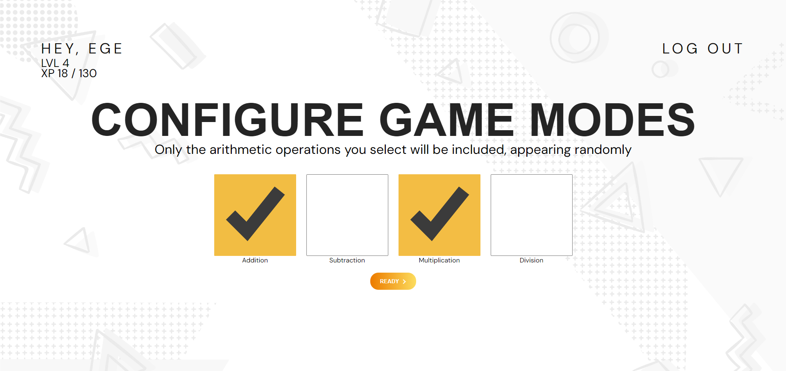
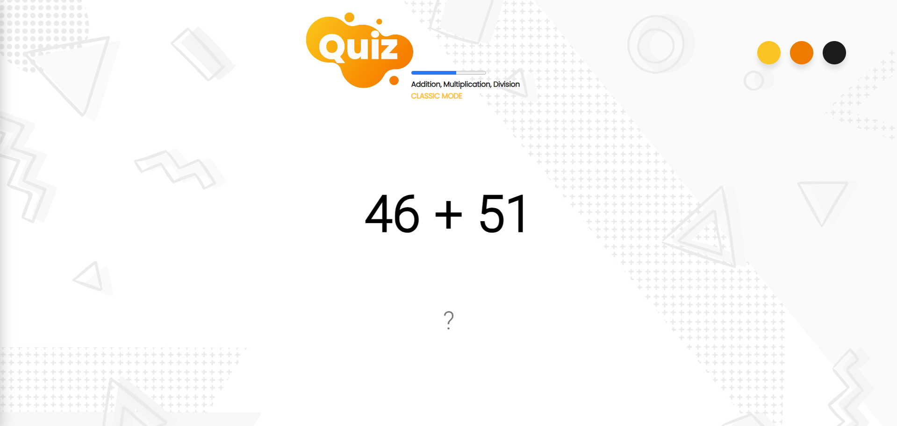

# ArithmeticK 
#### Video Demo: https://www.youtube.com/watch?v=wJG1kwwYl3M
#### Description: The mathematics gamification web application, developed using JavaScript and Python with the Flask framework, served as a final project for the CS50 course.
## CS50
> [!IMPORTANT]
> CS50 Introduction to Computer Science

### About Course
This course is a game-changing computer science course offered by **Harvard University**. Led by the incredible **Professor David J. Malan**, this course covers fundamental concepts in programming, algorithms, and computer science. It's renowned for its engaging lectures, hands-on projects, and a supportive community that fosters a deep understanding of coding principles. Whether you're a beginner or aiming to enhance your programming prowess, CS50 offers an enriching experience that equips you with valuable skills for the tech world.

> This course **holds a prime spot in my life** with dozens of hands-on laboratory applications that range from coding a social media photo filter, tracking down a thief through database queries, understanding the Caesar's cipher encryption algorithm, to coding a financial stock market website. There are lab assignments on democratic voting systems and even a DNA sequencing algorithm. It's packed with enriching experiences that solidify learning in an incredible way.

  > [!NOTE]
  > Where can I get CS50 course? [Click here!](https://cs50.harvard.edu/x/2023/)

### About Project
I aimed to create a gamified web application where you earn experience points and level up by quickly performing addition, subtraction, multiplication, and division operations mentally. To have complete freedom in each set of 10 questions, I coded personalized settings for each, allowing you to choose which mathematical operations to include, decide on the number of digits for the numbers involved, and view your statistics.

**Much can be done to improve:**
- [ ] Leaderboard can be added
- [ ] Gamification elements can be added, such as badges
- [ ] Memorize and Cumulative game modes can be added

### Screenshots
  | Login | Register | Index |
  | :---: | :---: | :---: |
  |   |  |  |
  | Ready | Game | Statistics |
  |   |  |  |

### Technologies
> [!TIP]
> Javascript, Python, HTML, CSS, SQLite3, Flask

### How is it works?

1. After logging in, you select which game modes you want to add, and upon pressing the button, you are redirected to the open game page with the settings panel.
   
   > The selected checkboxes are sent to Python with an array via POST. Saved in session and then used in /game page
   
3. After making personalized configurations in the settings panel, you can start the questions by pressing the ready button.
   
   > The javascript running on the front end of the site, the maximum and minimum values that the numbers can take in each game mode and the number of digits of the number are determined
   
4. After the set of ten questions is finished, you will be routed to the /results page to see the statistics of the game played.
   
   > On the javascript side, the statistics of each question, such as reaction times, are collected one by one in an array that covers all ten questions, and waited to be sent to python in json format.
   
5. The data sent by javascript in json format is processed line by line with the help of flask in python and the rows are colored according to the overall average. According to the Z-score, we can see how many standard deviations away it is with the amount of symbols
   
   > This data is saved to sql with the help of cs50 library from python. Then query again for the session to be displayed.
   
   > The statistics for the rows of math operations where you are slower than your average appear red, while those where you are faster appear green. Depending on the standard deviation, the color appears darker and the number of symbols changes.
   
6. When you return to the main menu you can see the new amount of exp you have earned.
   
   > Total exp is queried from the database and then substituted into the formula to calculate your level and remaining exp.
   ```python
   while exp >= (100 + (10 * (lvl - 1))):
       exp = exp - (100 + (10 * (lvl - 1)))
       lvl = lvl + 1
   ```
   
## Project Structure
### Files & Directories
- `project`
  - `static` - Folder that stores css, engine and etc. to make the website look fluid and alive
    - `arithmetick-bg.png`
    - `game-engine.js` - General game logic
    - `parallax.js`
    - `quiz.ico`
    - `quiz.png`
    - `styles.css`
  - `templates` - Folder where all pages of the website are stored
    - `game.html`
    - `index.html`
    - `layout.html`
    - `login.html`
    - `register.html`
    - `result.html`
  - `app.py` - Backend operations
  - `data.db`
    
### Important logic on the pages
- #### Layout HTML
  ```html
  <head>
      <!-- This is to ensure that the shown page appears in the chrome tab with the page name -->
      <title>ArithmeticK </title>

      <!-- This block that allows some resources to use the link element on only one unique page -->
      
  </head>
  <body>
      <main>
          <!-- This block is used to fill the general content of all pages with data from python -->
          
      </main>
  </body>
  ```
  
- #### Index HTML
  ```html
  <form action="/" method="post">
      <ul class="configure-settings">
          <li><input type="checkbox" id="addition" name="game_mode" value="Addition"></input><label for="addition">Addition</label></li>
          <li><input type="checkbox" id="subtraction" name="game_mode" value="Subtraction"></input><label for="subtraction">Subtraction</label></li>
          <li><input type="checkbox" id="multiplication" name="game_mode" value="Multiplication"></input><label for="multiplication">Multiplication</label></li>
          <li><input type="checkbox" id="division" name="game_mode" value="Division"></input><label for="division">Division</label></li>
      </ul>
  </form>
  ```
  All checkboxes you select here are sent to python in an array.
  ```html
  <div class="configure-profile">
      <p class="upper-panel-text">HEY, {{ data["username"] }}</p>
      <p>LVL {{ lvl }}</p>
      <p>XP {{ exp }} / {{ formula }}</p>
  </div>
  ```
  Here, the data calculated from python is transferred to html with the help of flask.
  
- #### Game HTML
  ```html
  <label for="addition-min"><input type="number" id="addition-min" onkeypress="return event.preventDefault()" onkeyup="return checkMinMaxInput(event, id, 'addition-max')" value="1"> Min</label>
  ```
  Logic with backend control created to recalculate each minimum maximum value in the settings panel depending on each other and to prevent the user from dialing anything other than a value between 1 and 5.
  ```html
  <div class="operation-container" id="operation-container">
      <div class="operation-left"><h1 id="placeholder-left"></h1></div>
      <div class="operation-center"><h1 id="placeholder-center"></h1></div>
      <div class="operation-right"><h1 id="placeholder-right"></h1></div>
  </div>
  ```
  **CSS**
  ```css
  .operation-left {
      width: 100px;
      text-align: right;
      margin-right: 30px;
      direction: rtl; /*text overflow left instead of right*/
  }
  .operation-right {
      width: 100px;
      text-align: left;
      margin-left: 30px;
  }
  ```
  Logic set up so that the math operation symbol in the center of the screen does not shift left or right regardless of the size of the numbers.
  
- #### Results HTML
  ```html
  <tbody>
      
          <!-- If the reaction time is greater than the average, it appears in red and the color becomes darker according to the z score -->
          <!-- If not, it appears green and the color becomes darker according to the z score -->
          <tr 
                  style="background-color:rgba(255,0,0, {{0.1 * zscore_data[loop.index-1]}})"
              
                  style="background-color:rgba(0,255,0, {{0.3 * zscore_data[loop.index-1]}})"
              >
              <th scope="row">{{ loop.index }}</th>
              <td>{{ item["experience_reward"] }}</td>
              <td>{{ item["operation_text"] }} = {{ item["answer"] }}</td>
              <td>{{ item["reaction_time"] }}</td>
              <td>
                  <!-- This indicates how many standard deviations the average is either above or below -->
                  
                      {{ "-" * zscore_data[loop.index-1] }}
                  
                      =
                  
                      {{ "+" * zscore_data[loop.index-1] }}
                  
              </td>
          </tr>
      
  </tbody>
  ```
  With the help of Flask framework, adjusting the colors and symbol counts by passing the data coming from python through condition checks in html.

## Known vulnerabilities
> [!CAUTION]
> An incorrect object can be sent to Python by manipulating the JavaScript data object during the game.

> [!CAUTION]
> Login/registration systems are encrypted but not protected.

## Attributions
[Background](https://www.freepik.com/free-vector/hand-drawn-nostalgic-90-s-background_16685702.htm#query=90s%20background&position=1&from_view=keyword&track=ais&uuid=53f91a78-50a6-4810-a4a6-3ddc6a60bd5f)
[Basic parallax system](https://codepen.io/Mojer/pen/VrqrbN)
[Main animated button](https://uiverse.io/satyamchaudharydev/modern-sheep-10)
[Three animated buttons](https://uiverse.io/david-mohseni/brave-shrimp-86)
[Alert message box](https://www.w3schools.com/howto/howto_js_alert.asp)
